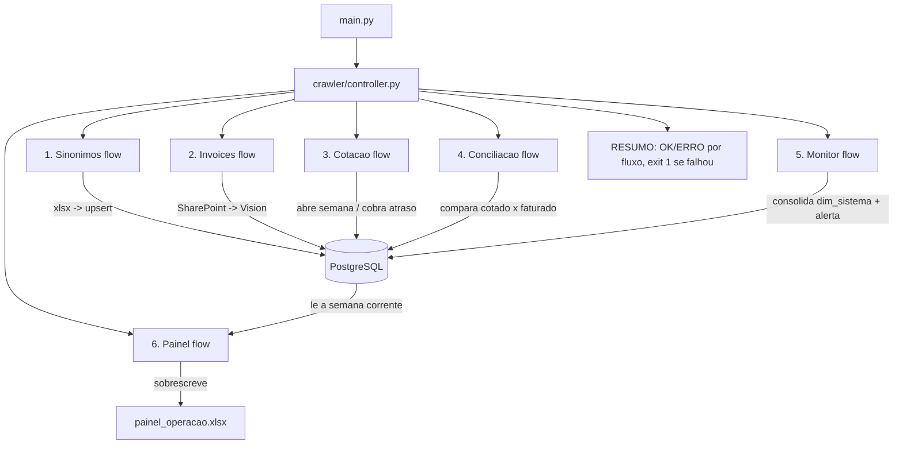

# RPA Schiavon

> Pipeline que baixa invoices de fornecedores do SharePoint, lê os dados com o
> Claude Vision, mantém a cotação semanal de carnes e concilia o preço cotado
> contra o faturado. Persiste em PostgreSQL (Azure).

Documento de sustentação (DataGuvi). O detalhamento de arquitetura por módulo
(grafo de dependências, decisões, "o que não funciona") está em
**[`LEIA.md`](LEIA.md)**.

## Índice

- [1. Visão Geral](#1-visão-geral)
- [2. Dados da Automação](#2-dados-da-automação)
- [3. Pré-requisitos](#3-pré-requisitos)
- [4. Configuração](#4-configuração)
- [5. Fluxograma Macro](#5-fluxograma-macro)
- [6. Execução](#6-execução)
- [7. Sustentação](#7-sustentação)
- [8. Status de Execução](#8-status-de-execução)

---

## 1. Visão Geral

Uma execução de `python main.py` faz **uma passada** e termina, nesta ordem:

| # | Fluxo | O que faz |
|---|---|---|
| 1 | Sinônimos | `files/sinonimos/*.xlsx` → `dim_item_sinonimo` (vocabulário de item) |
| 2 | Invoices | SharePoint → Claude Vision → `fat_invoice` / `fat_invoice_item` |
| 3 | Cotação | avança **um** passo do ciclo semanal de carnes |
| 4 | Conciliação | `fat_cotacao_preco` × `fat_invoice_item` → `fat_conciliacao` / `_item` |
| 5 | Monitor | consolida acesso por sistema, abre/fecha alertas à operação |
| 6 | Painel | consolida a semana corrente em `files/relatorios/painel_operacao.xlsx` — duas abas (Cotacao x Invoice e Divergencias Cotacao x Invoice), o relatório que o cliente abre |

Cada fluxo roda isolado: se um falha, os outros seguem; o RESUMO no fim lista
OK/ERRO e o processo sai com código 1 para o cron alertar. **Não há flags** — quem
precisa de um passo isolado chama o módulo direto.

## 2. Dados da Automação

| Campo | Valor |
|---|---|
| Nome do Robô | RPA Schiavon |
| Empresa | DataGuvi |
| Cliente | Schiavon |
| Entrada em produção | _(a definir)_ |
| Periodicidade | cron — a cada 1 h (a confirmar) |

### Tabelas

| Schema | Tabelas |
|---|---|
| `dwschiavon2` | `processo` (controle do caso), `fat_invoice` / `fat_invoice_item`, `fat_cotacao_preco` / `fat_cotacao_envio`, `fat_conciliacao` / `_item`, `dim_fornecedor` / `dim_fornecedor_alias`, `dim_item_sinonimo`, `dim_sistema`, `alerta` |

### Saída

| Artefato | O que é |
|---|---|
| `files/relatorios/painel_operacao.xlsx` | Relatório do cliente (FLUXO 6) — abas "Cotacao x Invoice" (itens que conciliaram) e "Divergencias Cotacao x Invoice"; sobrescrito a cada execução, sempre o estado atual da semana |

DDL em `sql/` (migração por fluxo; parte do sistema ainda lê `dwschiavon` via
`search_path`).

## 3. Pré-requisitos

- **Python** 3.12+
- **PostgreSQL** acessível (Azure, `sslmode=require`)
- **Playwright** com Chromium instalado (`playwright install chromium`) — usado
  na sessão do SharePoint
- Dependências: `pip install -r requirements.txt`
- Acesso de rede a: SharePoint (Microsoft 365), API Anthropic, SMTP, Twilio

## 4. Configuração

Segredo **não vai versionado**. Fica no profile local (a partir da Fase 5:
`resources/config-dev.env` / `config-prod.env`; hoje: `.env` na raiz, no
`.gitignore`).

```env
# PostgreSQL
HOST=...            PORT=5432
DATABASE=dw02       SCHEMA=dwschiavon
USER=...            PASSWORD=...

# SharePoint (Microsoft 365)
SHAREPOINT_USERNAME=...
SHAREPOINT_PASSWORD=...

# Claude Vision (Anthropic)
schiavon_key_vision=sk-ant-...
VISION_MODEL=claude-sonnet-4-6      # haiku-4-5 | sonnet-4-6 | opus-4-8

# Alerta à operação (opcional; default dataguvi@gmail.com)
ALERTA_EMAIL=...
```

## 5. Fluxograma Macro



## 6. Execução

| Comando | O que faz |
|---|---|
| `python main.py` | Roda os 6 fluxos, em ordem. Sem flags. |
| `python -m cotacao.cotacao` | Avança um passo do ciclo de cotação (isolado) |
| `python -m manutencao.<nome>` | Scripts de manutenção — **simulam por padrão**, gravam só com `--aplicar` |
| `python -m pytest` | Testes (motor de match, em memória, sem Postgres) |

## 7. Sustentação

- **Log:** hoje em stdout (cron redireciona). A partir da Fase 5, `logging` via
  `commons/logging_config.py` + arquivo rotativo em `resources/log/`.
- **Monitoramento:** o fluxo 5 (Monitor) carimba `dim_sistema` por sistema e
  abre `alerta` (dedupe + e-mail à operação) para sistema crítico com acesso
  falho ou fluxo parado há > 12 h. O alerta se resolve sozinho quando a causa
  some.
- **Reprocesso:** casos em `processo` com `cod_status` na faixa 50–59 são
  reprocessáveis; caem sozinhos na fila quando um sinônimo/alias novo pode ter
  destravado a nota.
- **Não tentar de novo:** MSAL device flow no tenant do cliente; `requests` com
  basic auth no SharePoint; `client.messages.parse()` com schema complexo;
  `thinking=adaptive` com structured output. Detalhe em `LEIA.md`.

## 8. Status de Execução

Gravado em `processo.cod_status` (fonte da verdade em `utils/status_exec.py` →
`domain/enums.py`). Faixas: `0–9` terminou · `10–19` em curso · `20–29`
encerrado sem completar · `50–59` erro técnico (única faixa reprocessável).

| Código | Status | Descrição | % | Tipo |
|---|---|---|---|---|
| 0 | `FINALIZADO` | Todas as etapas concluídas | 100 | Final |
| 1 | `FINALIZADO_COM_ALERTA` | Concluído, há item para conferir | 100 | Final |
| 10 | `PENDENTE` | Criado, nenhuma etapa rodou | 0 | Temporário |
| 11 | `EM_ANDAMENTO` | Alguma etapa concluída, faltam outras | — | Temporário |
| 12 | `AGUARDANDO_RESPOSTA` | Parado à espera do fornecedor | — | Temporário |
| 20 | `ENCERRADO_SEM_COTACAO` | Sem cotação da semana para comparar | — | Final |
| 21 | `ENCERRADO_SEM_ARQUIVO` | Pasta da semana existe, mas vazia | — | Final |
| 50 | `ERRO_LOGIN` | Falha de autenticação na origem | — | Final (Erro) |
| 51 | `ERRO_NAVEGACAO` | Pasta/arquivo não encontrado na origem | — | Final (Erro) |
| 52 | `ERRO_LEITURA` | A IA não conseguiu extrair o documento | — | Final (Erro) |
| 53 | `ERRO_API` | Falha de rede ou de serviço externo | — | Final (Erro) |
| 54 | `ERRO_BAIXA_CONFIANCA` | Leitura abaixo do piso de confiança | — | Final (Erro) |
| 55 | `ERRO_SEM_FORNECEDOR` | Nome da nota não casou com nenhum alias | — | Final (Erro) |
| 56 | `REPROCESSAR_CONCILIACAO` | Marcado para reconciliar após correção de de-para | — | Reprocesso |

### Progressão normal (caso "nota")

```
PENDENTE (0%) -> COLETAR -> LER -> IDENTIFICAR_FORNECEDOR -> CONCILIAR_COTACAO -> FINALIZADO (100%)
```

### Fluxos de erro

```
COLETAR      -> ERRO_LOGIN | ERRO_NAVEGACAO
LER          -> ERRO_LEITURA | ERRO_API | ERRO_BAIXA_CONFIANCA
IDENTIFICAR  -> ERRO_SEM_FORNECEDOR
```
