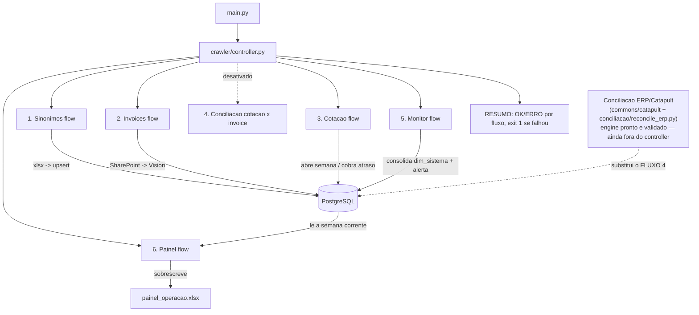

# RPA Schiavon

> Pipeline que baixa invoices de fornecedores do SharePoint, lê os dados com o
> Claude Vision, mantém a cotação semanal de carnes e concilia a nota contra
> o pedido/PO lançado no ERP Catapult. Persiste em PostgreSQL (Azure).

Documento único de sustentação (DataGuvi) — arquitetura, dependências entre
módulos e "o que não funciona" vivem aqui, não mais num `LEIA.md` separado.

## Índice

- [1. Visão Geral](#1-visão-geral)
- [2. Dados da Automação](#2-dados-da-automação)
- [3. Pré-requisitos](#3-pré-requisitos)
- [4. Configuração](#4-configuração)
- [5. Fluxograma Macro](#5-fluxograma-macro)
- [6. Execução](#6-execução)
- [7. Sustentação](#7-sustentação)
- [8. Status de Execução](#8-status-de-execução)
- [9. Estrutura do Projeto](#9-estrutura-do-projeto)
- [10. Conciliação ERP/Catapult (em construção)](#10-conciliação-erpcatapult-em-construção)
- [11. O que NÃO funciona](#11-o-que-não-funciona)
- [12. Próximos passos](#12-próximos-passos)

---

## 1. Visão Geral

Uma execução de `python main.py` faz **uma passada** e termina, nesta ordem
(`crawler/controller.py::executar`):

| # | Fluxo | O que faz |
|---|---|---|
| 1 | Sinônimos | `files/sinonimos/*.xlsx` → `dim_item_sinonimo` (vocabulário de item) |
| 2 | Invoices | SharePoint → Claude Vision → `fat_invoice` / `fat_invoice_item` |
| 3 | Cotação | avança **um** passo do ciclo semanal de carnes |
| ~~4~~ | ~~Conciliação cotação × invoice~~ | **desativado** — a conferência da nota passou a ser contra o pedido/PO do Catapult, não contra a cotação semanal de carnes (ver [§10](#10-conciliação-erpcatapult-em-construção)) |
| 5 | Monitor | consolida acesso por sistema, abre/fecha alertas à operação |
| 6 | Painel | consolida a semana corrente em `files/relatorios/painel_operacao.xlsx` |

Cada fluxo roda isolado: se um falha, os outros seguem; o RESUMO no fim lista
OK/ERRO e o processo sai com código 1 para o cron alertar. **Não há flags** —
quem precisa de um passo isolado chama o módulo direto.

> **FLUXO 4 desativado tem um efeito colateral real**: como nenhuma invoice
> nova gera mais linha `fat_conciliacao(comparacao='cotacao')`, as abas do
> painel (`fetch_comparacao_precos` / `fetch_divergencias`, que leem só esse
> `comparacao`) param de ganhar dado novo até a conciliação ERP (§10) existir
> e assumir esse papel — ou até o painel ser reescrito para ler
> `comparacao='erp'`.

## 2. Dados da Automação

| Campo | Valor |
|---|---|
| Nome do Robô | RPA Schiavon |
| Empresa | DataGuvi |
| Cliente | Schiavon |
| Entrada em produção | _(a definir)_ |
| Periodicidade | cron — a cada 1 h (a confirmar) |

### Tabelas

| Schema | Tabelas |
|---|---|
| `dwschiavon2` | `processo` (controle do caso), `fat_invoice` / `fat_invoice_item`, `fat_cotacao_preco` / `fat_cotacao_envio`, `fat_conciliacao` / `_item`, `dim_fornecedor` / `dim_fornecedor_alias`, `dim_item_sinonimo`, `dim_item_catapult`, `dim_sistema`, `alerta`, `agendamento` |

`domain/service/processo_service.py::SCHEMA` é a fonte da verdade do nome do
schema (hoje `dwschiavon2`) — nunca escrito à mão em SQL espalhado.

### Saída

| Artefato | O que é |
|---|---|
| `files/relatorios/painel_operacao.xlsx` | Relatório do cliente (FLUXO 6) — abas "Cotacao x Invoice" e "Divergencias Cotacao x Invoice"; sobrescrito a cada execução |

DDL em `sql/migrate_dwschiavon2_atual.sql` (idempotente — `ADD COLUMN IF NOT
EXISTS` / `CREATE TABLE IF NOT EXISTS`; aplicar com `python sql/_apply.py`).
Diagramas gerados em `sql/dwschiavon2_der.puml` / `_fluxo.puml`.

## 3. Pré-requisitos

- **Python** 3.12+
- **PostgreSQL** acessível (Azure, `sslmode=require`)
- **Playwright** com Chromium instalado (`playwright install chromium`) —
  usado nas sessões do SharePoint e do Catapult
- Dependências: `pip install -r requirements.txt`
- Acesso de rede a: SharePoint (Microsoft 365), API Anthropic, SMTP, Twilio,
  Catapult/ECRS (atrás de Cloudflare Access)
- Uma caixa Gmail autorizada via OAuth (`python -m
  manutencao.gmail_oauth_setup`) — usada para ler o código OTP do Cloudflare
  Access na hora de logar no Catapult (`commons/gmail`)

## 4. Configuração

Segredo **não vai versionado**. Fica em um profile por ambiente,
`resources/config-dev.env` e `resources/config-prod.env` (ambos no
`.gitignore`); não existe arquivo genérico. O ativo sai da variável de ambiente
`RPA_ENV` (`dev` | `prod`, default `prod`; qualquer outro valor aborta a
execução). Comece copiando `resources/config.example.env`, que lista todas as
chaves sem valor.

Formato estrito `CHAVE=VALOR` (o separador `:` não é aceito). A leitura é
tipada em `domain/config.py`: os fluxos recebem um objeto `Config`
(`config.banco`, `config.ecrs.usuario`, ...), não um dicionário cru. Só as 5
chaves de conexão com o banco são obrigatórias para iniciar; a ausência delas é
reportada de uma vez só. Credencial de sistema externo ausente não derruba o
carregamento — o fluxo daquele sistema pula com aviso e o `dim_sistema` registra
o que falta.

```env
# PostgreSQL
HOST=...            PORT=5432
DATABASE=...        SCHEMA=dwschiavon2
USER=...            PASSWORD=...

# SharePoint (Microsoft 365) — duas contas (Windermere / Dr. Phillips)
SHAREPOINT_USERNAME=...      SHAREPOINT_PASSWORD=...
SHAREPOINT_USERNAME2=...     SHAREPOINT_PASSWORD2=...

# Claude Vision (Anthropic)
schiavon_key_vision=sk-ant-...
VISION_MODEL=claude-sonnet-4-6      # haiku-4-5 | sonnet-4-6 | opus-4-8

# E-mail (SMTP) e WhatsApp (Twilio) — cotação semanal
SMTP_HOST=...   SMTP_PORT=...   SMTP_USER=...   SMTP_PASSWORD=...   SMTP_FROM=...
ACCOUNT_SID=...   AUTH_TOKEN=...   TWILIO_NUMBER=...   TWILIO_CONTENT_SID=...

# ERP Catapult (ECRS) — atrás de Cloudflare Access
ECRS_WINDERMERE=...   ECRS_DRPHILIPS=...   ECRS_HQ=...
ECRS_USER=...   ECRS_PASSWORD=...
CLOUDFLARE_ACCESS_EMAIL=...      # caixa que recebe o OTP do Access

# Alerta à operação (opcional; default dataguvi@gmail.com)
ALERTA_EMAIL=...
```

## 5. Fluxograma Macro



## 6. Execução

| Comando | O que faz |
|---|---|
| `python main.py` | Roda os fluxos ativos (1, 2, 3, 5, 6), em ordem. Sem flags. |
| `python -m cotacao.cotacao` | Avança um passo do ciclo de cotação (isolado) |
| `python -m manutencao.<nome>` | Scripts de manutenção — **simulam por padrão**, gravam só com `--aplicar` |
| `python -m manutencao.catapult_inventory_scrape [windermere\|drphilips\|hq]` | Raspa o catálogo Inventory do Catapult → `dim_item_catapult` |
| `python -m manutencao.teste_conciliacao_erp` | Teste manual ponta a ponta da conciliação ERP: login → busca PO por invoice → compara → imprime (não grava) |
| `python -m manutencao.gmail_oauth_setup` | Autoriza a caixa Gmail que lê o OTP do Cloudflare Access |
| `python -m manutencao.teste_servidor [--email] [--login]` | Smoke test do servidor (banco, Chromium, Claude, Sheets, Gmail, SMTP); somente leitura |
| `python -m pytest` | Testes (motor de match e conciliação ERP, em memória, sem Postgres) |

## 7. Sustentação

- **Log:** hoje em stdout (cron redireciona). `logging` via
  `commons/logging_config.py`.
- **Monitoramento:** o FLUXO 5 (Monitor) carimba `dim_sistema` por sistema e
  abre `alerta` (dedupe + e-mail à operação) para sistema crítico com acesso
  falho ou fluxo parado há > 12 h. O alerta se resolve sozinho quando a causa
  some. Login em cada sistema chama `sistema_service.registrar_acesso`.
- **E-mails (spec `.claude/rules/spec-notificacao-email.md`):**
  - *Cliente:* ao fim da Conciliação ERP, **um e-mail por invoice** (limite de
    25 MB do Outlook), com o `.docx` dela anexado; o assunto diz *Divergência*
    ou *Conciliação*. Vai para `DESTINATARIOS_CLIENTE`
    (`domain/config.py`). `bpo@rokkasmarket.com` está comentado até validar o
    envio; para ligar, descomente a linha.
  - *Erro:* qualquer falha (BD, login SharePoint, elemento não achado no
    Catapult, falha de e-mail, fluxo que caiu) é registrada em
    `notificacao_service.registrar_erro` e o controller envia **um** e-mail
    consolidado, com traceback, a `ALERTA_EMAIL` (default `dataguvi@gmail.com`).
    Aborto antes dos fluxos (profile/banco inválido) só aparece no log.
- **Reprocesso:** casos em `processo` com `cod_status` na faixa 50–59 são
  reprocessáveis; caem sozinhos na fila quando um sinônimo/alias novo pode
  ter destravado a nota (`domain/service/conciliacao_service.py::marcar_*`).
- **Catapult/Cloudflare Access:** a sessão pede um OTP por e-mail a cada
  login novo; `commons/gmail.fetch_otp_code` lê o código automaticamente da
  caixa em `CLOUDFLARE_ACCESS_EMAIL`. Se a conta perder acesso ao app no
  Cloudflare Zero Trust, o login falha com *"That account does not have
  access"* — ajuste é do lado da política do Cloudflare, não do código.
- **Não tentar de novo:** ver [§11](#11-o-que-não-funciona).

## 8. Status de Execução

Gravado em `processo.cod_status` (fonte da verdade: `domain/enums.py` →
`StatusExecEnum`). Faixas: `0–9` terminou · `10–19` em curso · `20–29`
encerrado sem completar · `50–59` erro técnico (única faixa reprocessável).

| Código | Status | Descrição | % | Tipo |
|---|---|---|---|---|
| 0 | `FINALIZADO` | Todas as etapas concluídas | 100 | Final |
| 1 | `FINALIZADO_COM_ALERTA` | Concluído, há item para conferir | 100 | Final |
| 10 | `PENDENTE` | Criado, nenhuma etapa rodou | 0 | Temporário |
| 11 | `EM_ANDAMENTO` | Alguma etapa concluída, faltam outras | — | Temporário |
| 12 | `AGUARDANDO_RESPOSTA` | Parado à espera do fornecedor | — | Temporário |
| 20 | `ENCERRADO_SEM_COTACAO` | Sem cotação da semana para comparar | — | Final |
| 21 | `ENCERRADO_SEM_ARQUIVO` | Pasta da semana existe, mas vazia | — | Final |
| 50 | `ERRO_LOGIN` | Falha de autenticação na origem | — | Final (Erro) |
| 51 | `ERRO_NAVEGACAO` | Pasta/arquivo não encontrado na origem | — | Final (Erro) |
| 52 | `ERRO_LEITURA` | A IA não conseguiu extrair o documento | — | Final (Erro) |
| 53 | `ERRO_API` | Falha de rede ou de serviço externo | — | Final (Erro) |
| 54 | `ERRO_BAIXA_CONFIANCA` | Leitura abaixo do piso de confiança | — | Final (Erro) |
| 55 | `ERRO_SEM_FORNECEDOR` | Nome da nota não casou com nenhum alias | — | Final (Erro) |
| 56 | `REPROCESSAR_CONCILIACAO` | Marcado para reconciliar após correção de de-para | — | Reprocesso |

### Progressão normal (caso "nota")

```
PENDENTE (0%) -> COLETAR -> LER -> IDENTIFICAR_FORNECEDOR -> CONCILIAR_COTACAO -> FINALIZADO (100%)
```

### Fluxos de erro

```
COLETAR      -> ERRO_LOGIN | ERRO_NAVEGACAO
LER          -> ERRO_LEITURA | ERRO_API | ERRO_BAIXA_CONFIANCA
IDENTIFICAR  -> ERRO_SEM_FORNECEDOR
```

### Um segundo vocabulário: veredito da comparação

`StatusExecEnum` (acima) é o ciclo de vida do *caso*. Separado dele,
`StatusConciliacaoEnum` (também em `domain/enums.py`) é o veredito de UMA
comparação, gravado em `fat_conciliacao(_item).cod_status` — o mesmo
`id_invoice` pode ter até duas linhas em `fat_conciliacao`, uma por
`comparacao` (`'cotacao'` | `'erp'`):

| Código | Status | Faixa |
|---|---|---|
| 0 | `CONFERIDO` | bate |
| 10 | `PRECO_ACIMA` | diverge (cotação) |
| 11 | `PRECO_ABAIXO` | diverge (cotação) |
| 12 | `DIVERGENCIA` | diverge (ERP — qtd e/ou preço fora da tolerância contra o PO) |
| 20 | `SEM_REFERENCIA_ITEM` | não dá para comparar |
| 21 | `UNIDADE_DIVERGENTE` | não dá para comparar |

## 9. Estrutura do Projeto

`commons` é ferramenta (sem regra de negócio), `domain` é o dado e a regra,
`crawler` é o robô (orquestração + contrato de fluxo). Ver
`.claude/rules/governanca.md` para a regra completa.

```
projeto_schiavon_agente/
│
├── main.py                       # Entrypoint fino: try/except em volta de crawler.controller.executar()
│
├── crawler/
│   ├── controller.py              #   executar() — monta o Pipeline, chama uma fachada por fluxo
│   ├── pipeline.py                #   Pipeline: roda fluxos isolando falha + RESUMO + exit code
│   ├── flow/                      #   uma fachada por FLUXO (sinonimos_flow, invoices_flow, ...)
│   └── reports/                   #   execution_report.py, painel_excel.py
│
├── commons/                      # Infraestrutura compartilhada, sem regra de negócio
│   ├── db.py                      #   load_env, connect_db
│   ├── paths.py                   #   diretórios do projeto, resolvidos num lugar só
│   ├── exception.py                #   BusinessException / CrawlerException / IntegracaoException / DataAccessException
│   ├── logging_config.py          #   setup de logging
│   ├── banner.py · texto.py
│   ├── matcher.py                 #   motor de match e tolerância — sem import do projeto (stdlib + rapidfuzz)
│   ├── sharepoint/                #   cliente SharePoint (REST + Playwright)
│   ├── catapult/                  #   sessão Catapult (Cloudflare Access + login) + busca/raspagem de PO
│   ├── vision/                    #   cliente Claude Vision
│   ├── gmail/                     #   leitura de OTP por e-mail (Gmail API)
│   └── messaging/                 #   Twilio (WhatsApp)
│
├── domain/                       # Modelo de dados e regra de negócio
│   ├── enums.py                   #   StatusExecEnum, StatusConciliacaoEnum, EtapaEnum — fonte da verdade dos status
│   ├── conciliacao_codes.py       #   IssueCode — vocabulário de divergência (cotação e ERP)
│   ├── categorias.py · classificacao.py · sistemas.py · alertas.py
│   ├── model/                     #   InvoiceData/Item, PriceRow/QuotationPrice — schema que o Vision preenche
│   └── service/                   #   todo acesso a banco por assunto: processo_, conciliacao_, cotacao_,
│                                   #   invoice_, prices_, agendamento_, sistema_, catapult_service.py
│
├── coleta_invoices/               # FLUXO 2
│   ├── coleta.py                  #   fachada
│   ├── vision.py                  #   leitura de PDF/imagem via Claude Vision + Batch API
│   ├── invoice_pipeline.py        #   coleta arquivos, lê com o Claude, persiste
│   └── invoices_db.py · classificacao.py
│
├── cotacao/                       # FLUXO 3 — ciclo semanal de carnes
│   ├── cotacao.py                 #   fachada (roda tb. via -m)
│   ├── quotation.py                #   ciclo semanal completo
│   ├── quotation_generator.py · prices.py · cotacao_db.py
│   └── messenger.py · email_sender.py · excel_handler.py · config_connection_twilio.py
│
├── conciliacao/                   # motor + regra de uma invoice (chamado pelas flows E por manutencao/)
│   ├── sinonimos.py                #   sincroniza dim_item_sinonimo — fachada do FLUXO 1
│   ├── reconcile_quote.py          #   regra da conciliação cotação x invoice (motor em commons/matcher.py)
│   ├── reconcile_erp.py            #   regra da conciliação invoice x PO Catapult (comparacao='erp')
│   ├── matcher.py                  #   shim de compatibilidade -> commons.matcher (Fase 2; remover na Fase 4)
│   └── conciliacao_db.py           #   shim de compatibilidade -> domain/service/conciliacao_service.py
│
├── manutencao/                    # Scripts avulsos, fora do pipeline — simulam por padrão, `--aplicar` grava
│   ├── catapult_explorar.py · catapult_inventory_scrape.py · teste_conciliacao_erp.py
│   ├── gmail_oauth_setup.py · importar_sinonimos.py · seed_item_sinonimos.py
│   └── seed_meat_suppliers.py · seed_supplier_alias.py · migrate_suppliers.py · comparar_fornecedores.py
│
├── sql/                           # DDL, migrações e diagramas
│   ├── migrate_dwschiavon2_atual.sql · _apply.py
│   └── dwschiavon2_der.puml/.png · dwschiavon2_fluxo.puml/.png
│
├── tests/                         # Testes em memória, sem Postgres
│   ├── test_matcher.py · test_reconcile_erp.py · test_resolver_fornecedor.py
│   └── test_sinonimos.py · test_painel_excel.py · test_painel_flow.py · test_config.py
│
├── files/
│   ├── unprocessed_files/ · read_files/    # baixadas / já lidas e gravadas
│   ├── price_quote/ · quotation_outbound/  # entrada manual / Excel de cotação gerado
│   ├── sinonimos/                          # DE_PARA_ITENS.xlsx
│   └── relatorios/                         # painel_operacao.xlsx
│
├── resources/
│   ├── config.example.env         # modelo do profile (versionado, sem segredo)
│   ├── config-dev.env · config-prod.env   # profiles reais (fora do git)
│   └── gmail/                     # token OAuth da caixa que lê o OTP do Cloudflare Access
│
└── requirements.txt · README.md
```

`utils/` e `models/` (nomes antigos de `commons/` e `domain/model/`) ainda
existem no diretório mas **não são mais importados por nenhum código ativo**
— sobra da migração para a estrutura acima, candidatos a remoção depois de
confirmar que nada os referencia de fato.

### Dependências entre módulos

A regra é que **nenhum fluxo importa outro fluxo**; o que dois fluxos
compartilham desce para `commons/` (se genérico) ou `domain/service/` (se é
dado/regra). `commons` não importa `domain` nem `crawler`; `domain` não
importa `crawler`.

```
commons/*                      <- sem imports de domain/crawler
commons/matcher.py             <- sem NENHUM import do projeto, de proposito (so stdlib + rapidfuzz)
domain/model/*                 <- sem imports do projeto
domain/service/*               <- usa helpers puros de commons (db, exception, paths, texto)

conciliacao/matcher.py         -> commons.matcher                          (shim, Fase 2)
conciliacao/conciliacao_db.py  -> domain.service.conciliacao_service       (shim, Fase 2)
conciliacao/sinonimos.py       -> commons.matcher, domain.service.conciliacao_service
conciliacao/reconcile_quote.py -> commons.matcher, domain.{categorias,conciliacao_codes,service.*}
conciliacao/reconcile_erp.py   -> commons.matcher, domain.conciliacao_codes

crawler/flow/*                 -> commons.*, domain.service.*, conciliacao.* (a fachada da etapa)
crawler/controller.py          -> crawler.{pipeline,flow.*}, commons.*, domain.service.*
main.py                        -> crawler.controller
manutencao/*                   -> atravessa camadas de proposito (sao correcoes pontuais)
```

Duas escolhas que valem explicação:

- **`commons/matcher.py`** não importa nada do projeto (só stdlib e
  `rapidfuzz`) e por isso guarda os próprios objetos de valor (`InvoiceLine`,
  `QuoteLine`, `POLine`, ...) em vez de usar `domain/model/`. É o que permite
  testá-lo sem Postgres e reaproveitá-lo tanto na frente cotação quanto na
  frente ERP.
- **`conciliacao/matcher.py`** e **`conciliacao/conciliacao_db.py`** são
  shims de compatibilidade (a lógica real já mora em `commons.matcher` e
  `domain.service.conciliacao_service`) — ainda importados por
  `manutencao/seed_item_sinonimos.py` e `manutencao/seed_supplier_alias.py`,
  então não saem até esses dois scripts migrarem.

Scripts em subpastas rodam como módulo, a partir da raiz: `python -m
manutencao.<nome>`.

## 10. Conciliação ERP/Catapult (em construção)

Substitui a conciliação por cotação (FLUXO 4, desativado) como a conferência
que vale para **toda** invoice, não só carne — o roteamento por categoria
(`domain/categorias.py::eh_cotavel`) manda carne para as duas comparações,
o resto só para o ERP.

**Motor pronto e validado contra o Catapult real** (login, busca de PO por
fornecedor, raspagem da grade de itens, match, comparação — caso real testado:
Restaurant Depot / Windermere, PO `Rest Depot-009616-RS1`):

- `commons/catapult/` — sessão autenticada (Cloudflare Access + login GWT),
  `search_purchase_orders_by_supplier` (busca por `Supplier contains`,
  categoria 'Purchase Order', Status='Ordered', 'Show History For' sempre
  desmarcado), `open_purchase_order`, `scrape_po_items`, `to_po_lines`.
- `commons/matcher.py::match_items_po` — casa item da invoice com item do PO
  em cascata: código (`item_code`/`upc` × `Supplier Unit ID`/`scancode`) →
  nome fuzzy (contra `item_name` OU `receipt_alias` do PO) → sem par.
- `conciliacao/reconcile_erp.py::escolher_po_por_itens` — quando a busca por
  fornecedor acha mais de um PO 'Ordered' (comum: um por invoice em aberto),
  desempata reaproveitando `match_items_po` contra os itens de cada
  candidato e ficando com o de maior fração de itens casados.
- `conciliacao/reconcile_erp.py::tem_anotacao_insumo` — nota com anotação à
  mão contendo "insumo" não é levada ao Catapult (regra de negócio; ver
  `crawler/flow/reconcile_erp_flow.py::_gravar_skip_insumo`).
- `conciliacao/reconcile_erp.py::reconcile_items_against_po` — compara
  quantidade (invoice × `Ordered` × `Received`) e valor (× `Invoiced Total
  Cost`) do par achado; agrega por item do PO quando mais de uma linha da
  invoice casa no mesmo item (ex.: mesmo produto escaneado em caixas
  separadas no caixa do fornecedor).
- `manutencao/teste_conciliacao_erp.py` — roda o fluxo inteiro à mão, sem
  gravar no banco; log separa preço/quantidade e explica cada divergência.

**Ainda falta para virar fluxo oficial:**

- Ligar ao `crawler/controller.py` (hoje só roda via `manutencao/`).
- Persistir o resultado em `fat_conciliacao_item(comparacao='erp')` —
  `save_reconciliation_header/_items` já aceitam `comparacao` por parâmetro.
- Decidir a política de `PO.Ordered = 0` (fornecedor sem PO prévio, ex.
  Restaurant Depot — sempre dá `QTY_MISMATCH_PO` mesmo sem divergência real).
  Pendente de validação com o cliente.
- Onde persistir `po_orphans` (item do PO recebido/pedido mas não reclamado
  por nenhuma linha da invoice) — `fat_conciliacao_item` hoje exige
  `id_invoice_item` `NOT NULL`, então não há linha pra esse caso ainda.

## 11. O que NÃO funciona

Testado e descartado — não tentar de novo sem mudar a premissa:

- **MSAL device flow / ROPC** — app público não autorizado no tenant
  `rokkasmarket.com`
- **`requests` com basic auth** — SharePoint moderno não aceita
- **`client.messages.parse()`** — `Grammar compilation timed out` para
  schemas complexos (usar `messages.create()` + `re.search + json.loads`)
- **`thinking={"type": "adaptive"}` com structured outputs** — causa timeout
- **Buscar PO no Catapult com `match_type='Begins with'`** (o padrão da
  tela) — o número que o funcionário digita no campo Invoice Reference pode
  ter o que a invoice imprime no MEIO da string, não no início; abre o PO
  errado em silêncio. Usar `'Contains'`.
- **Ler a grade Items do PO logo após o container aparecer** — a grade
  carrega em duas fases (container primeiro, corpo depois, assíncrono);
  ler cedo demais pega a grade vazia. Esperar por uma linha (`tr`) real.

## 12. Próximos passos

- Ligar a conciliação ERP/Catapult (§10) ao `crawler/controller.py` — o
  motor já está pronto e validado, falta o fluxo oficial + persistência.
- Reprocessar arquivos com `reading_status='failed'` ou `reading_confidence
  < 70`.
- Dashboard de custo acumulado (`SUM(cost_read)`).
- Migrar `manutencao/seed_item_sinonimos.py` e
  `manutencao/seed_supplier_alias.py` para `commons.matcher` /
  `domain.service.conciliacao_service`, liberando a remoção dos shims em
  `conciliacao/matcher.py` e `conciliacao/conciliacao_db.py`.
- Confirmar que `utils/` e `models/` (código antigo, sem import ativo) podem
  ser removidos.
